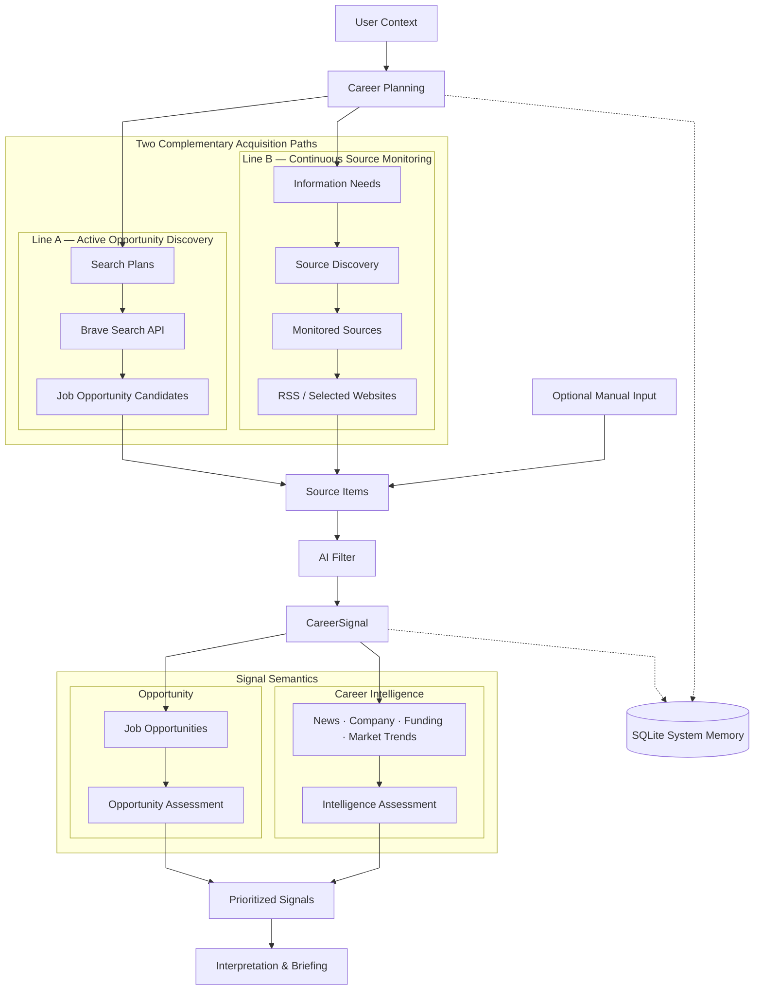
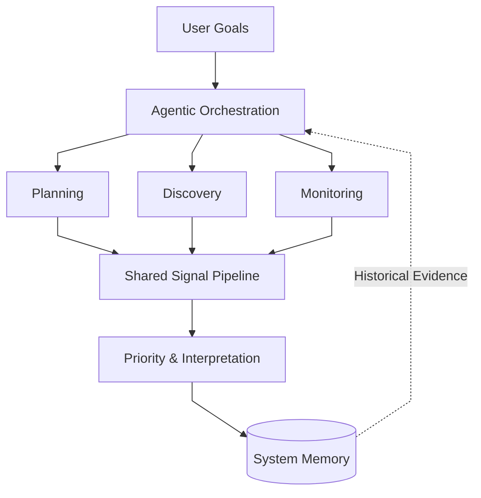

# PathSignal

### AI-powered Career Intelligence & Opportunity Discovery

PathSignal turns a user's background, career preferences, and target directions into a structured career-intelligence workflow — planning what to look for, discovering opportunities through active search and continuous source monitoring, using LLM reasoning where semantic judgment is needed, and converting useful findings into prioritized `CareerSignal`s.

**V1 · Public Snapshot**

`Career Planning` · `Active Discovery` · `Continuous Monitoring` · `AI Filtering` · `CareerSignals` · `Hybrid Priority Assessment` · `Persistent System Memory`

---
## V1 at a Glance

PathSignal V1 establishes a working career-intelligence workflow across four core layers:

| Layer                      | V1 Capabilities                                                                                                                        |
| -------------------------- | -------------------------------------------------------------------------------------------------------------------------------------- |
| **Planning**               | Profile & preference modeling · Target career path generation · Search query & search plan generation                                  |
| **Discovery & Monitoring** | Brave Search API · RSS feeds · Selected websites · Information-need & source-discovery workflow · Source evaluation & acquisition resolution ·  Monitoring runtime                       |
| **Intelligence**           | LLM-assisted filtering · `CareerSignal` normalization · Semantic priority assessment · Deterministic hybrid scoring & routing · Interpretation & briefing |
| **State & Validation**     | SQLite system memory · Canonical identity & deduplication · Pipeline & provenance tracking · Source-item, filter-decision & `CareerSignal` persistence · Contract & regression validation                      |


V1 deliberately focuses on establishing a stable, testable information workflow before introducing autonomous agent orchestration.

---
## System Architecture

PathSignal separates **how information is acquired** from **what that information means to the user**.

The first split creates two complementary automated acquisition strategies: **active opportunity discovery** and **continuous source monitoring**. Their outputs, together with optionally supplied human input, converge at the shared `SourceItem` layer before entering the same downstream signal pipeline. Once information is transformed into a `CareerSignal`, the second split routes it according to its semantic role: **opportunity** or **career intelligence**.




> **The first split represents how information is acquired. The second represents what that information means to the user.**

### V1 Boundary Notes

Optional human input enters at the shared `SourceItem` boundary, so manually discovered information does not bypass the same downstream filtering and assessment process.

Continuous Source Monitoring in V1 is **run-based rather than autonomously scheduled**. SQLite preserves state across runs; the dotted connections in the diagram are representative rather than exhaustive.

---

## 1. How the Pipeline Works

The architecture above shows **where responsibilities sit**.
The pipeline itself is easier to understand as a sequence of transformations — from personal context, to external information, to prioritized career signals.

### 1.1 Understand the User

PathSignal begins by separating factual background from career preferences.

```text
Resume / Background
        ↓
   UserProfile

Career Preferences
        ↓
 UserPreferences
```

`UserProfile` describes facts about the user — experience, skills, education, and other structured background information.

`UserPreferences` describes what the user actually wants: target directions, constraints, priorities, and career-policy choices.

This separation prevents downstream planning from treating a personal preference as if it were an objective fact.

---

### 1.2 Plan What to Look For

User context is translated into structured career-planning objects.

```text
UserProfile + UserPreferences
            ↓
     TargetCareerPaths
            ↓
       SearchQueries
            ↓
        SearchPlans
```

A `TargetCareerPath` defines a direction worth exploring.

A `SearchQuery` describes **what should be searched for**, while a `SearchPlan` turns that intent into an executable retrieval task.

For source monitoring, career context is also translated into longer-term **Information Needs**, which guide source discovery and monitoring decisions.

---

### 1.3 Acquire External Information

PathSignal supports multiple ways for information to enter the system.

**Active Opportunity Discovery**

```text
SearchPlans
    ↓
Brave Search API
    ↓
Opportunity Candidates
```

**Continuous Source Monitoring**

```text
Information Needs
      ↓
Source Discovery
      ↓
Monitored Sources
      ↓
RSS / Selected Websites
```

Monitoring in V1 is run-based: selected sources are checked when the monitoring workflow is executed rather than through autonomous background scheduling.

Manually discovered items can also be introduced into the shared acquisition layer.

Regardless of acquisition method, external information is converted into a provider-independent `SourceItem` representation before downstream reasoning begins.

---

### 1.4 Turn Information into CareerSignals

Not every retrieved item deserves further attention.

```text
SourceItem
    ↓
 AI Filter
    ↓
Normalizer
    ↓
CareerSignal
```

The AI Filter evaluates semantic relevance against the user's career context.

Accepted information is then normalized into a shared `CareerSignal` representation.

This boundary is important: downstream components no longer need to understand whether a signal originally came from Brave Search, an RSS feed, a selected website, or manual input.

---

### 1.5 Assess What Matters

Once information becomes a `CareerSignal`, PathSignal evaluates it according to its meaning rather than its source.

```text
CareerSignal
      ↓
 ┌────┴────┐
 ↓         ↓
Opportunity   Career Intelligence
 ↓                 ↓
Assessment       Assessment
 └────────┬────────┘
          ↓
   Prioritized Signal
```

Opportunity signals primarily represent directly actionable items such as job openings.

Career-intelligence signals represent developments — including company activity, funding, industry news, and market trends — that may influence career decisions without being an immediate application opportunity.

The two categories use different semantic assessment dimensions, while deterministic scoring logic combines those assessments with evidence such as path alignment, recency, source provenance, and confidence.

---

### 1.6 Remember, Interpret, and Surface

PathSignal does not treat every execution as a fresh session.

SQLite preserves planning and runtime state across runs, including information about what has already been planned, discovered, filtered, and accepted.

After priority assessment, signals can be routed into interpretation and briefing:

```text
Prioritized Signals
        ↓
Interpretation
        ↓
Career Intelligence Brief
```

The result is not simply a list of search results.

The pipeline progressively transforms:

> **personal context → search intent → external information → structured signals → prioritized decision support**

---
## 2. Intelligence & State Design

PathSignal does not treat AI reasoning, structured data, and persistence as separate technical features.

Together, they define **how the system represents information, makes bounded judgments, and remembers what has already happened**.

---

### 2.1 Data as the System Language

One of the most important lessons from building V1 was that data models are not merely storage formats.

They define what different pieces of information **mean inside the system**.

| Object             | Question it answers                             |
| ------------------ | ----------------------------------------------- |
| `UserProfile`      | What is true about the user?                    |
| `UserPreferences`  | What does the user want?                        |
| `SearchScope`      | How should retrieval be executed?               |
| `TargetCareerPath` | Which career directions are worth exploring?    |
| `SearchQuery`      | What should be searched for?                    |
| `SearchPlan`       | How should a concrete search be executed?       |
| `SourceItem`       | What did the outside world provide?             |
| `CareerSignal`     | What information is worth downstream reasoning? |

Several distinctions became especially important:

```text
UserProfile ≠ UserPreferences

UserPreferences ≠ SearchScope

SearchQuery ≠ SearchPlan

SourceItem ≠ CareerSignal

Planning State ≠ Runtime State
```

For example, a user's work experience is a fact, while a preference for AI strategy roles is a choice. Likewise, a search query expresses semantic intent, while a search plan defines how that intent should actually be executed.

Keeping these meanings separate makes downstream behavior easier to reason about and allows individual parts of the system to evolve without redefining everything around them.

---

### 2.2 Where LLM Reasoning Adds Value

PathSignal does not use an LLM simply because a task can be sent to one.

The working principle in V1 is:

> **Use LLM reasoning where semantic ambiguity exists. Prefer deterministic logic where correctness can be explicitly defined.**

#### LLM-assisted reasoning

LLMs are used for bounded tasks such as:

* target career path interpretation
* semantic relevance filtering
* information-need generation
* entity and source discovery reasoning
* semantic source evaluation
* priority assessment
* career-intelligence interpretation

These tasks require understanding context, meaning, relevance, or significance — areas where static rules alone are difficult to maintain.

#### Deterministic logic

Structured Python logic handles tasks including:

* schema validation
* identity and fingerprint generation
* search-scope derivation
* search query and plan construction
* normalization
* deduplication
* database persistence
* execution lifecycle tracking
* deterministic score composition
* acquisition policies and state management

This separation gives LLMs flexibility where interpretation is useful without allowing model output to become the source of truth for every part of the system.

---

### 2.3 Hybrid Priority Assessment

A relevant signal is not automatically an important signal.

PathSignal therefore separates **semantic assessment** from **final score composition**.

```text
        LLM Semantic Assessment
                  +
        Deterministic Evidence
                  ↓
          Priority Score
                  ↓
            Priority Tier
```

The semantic questions differ according to signal type.

| Signal Type             | LLM Semantic Focus                              |
| ----------------------- | ----------------------------------------------- |
| **Opportunity**         | User Policy Fit · Opportunity Feasibility       |
| **Career Intelligence** | Career Relevance Strength · Signal Significance |

Both categories are then combined with deterministic evidence such as:

* Path Alignment
* Recency
* Source Provenance
* AI Confidence

This creates a hybrid model in which the LLM contributes bounded semantic judgment, while explicit scoring rules determine how those judgments are combined.

The final priority is therefore **not an unconstrained model opinion**.

---

### 2.4 SQLite as System Memory

PathSignal uses SQLite as persistent system memory rather than merely as a place to save final outputs.

Across runs, the system can retain information about:

* planning bundles and career paths
* search queries and search plans
* pipeline-run lifecycle
* previously discovered source items
* repeated discoveries
* acquisition execution history
* filter coverage and decisions
* accepted `CareerSignal`s

This allows later executions to answer questions such as:

> Have I already seen this item?
> Has it already been filtered?
> Which planning state produced this search?
> Did this source produce anything new?
> What happened during the previous run?

Without persistent state, every execution would behave like an isolated script.

With it, PathSignal can gradually build memory across repeated runs — a foundation that becomes especially important if future versions introduce scheduled or agent-driven orchestration.

---

### Design Principle

Across these four areas, V1 follows the same general principle:

> **Give each layer the form of reasoning it handles best.**

Structured data defines meaning.
Deterministic software enforces rules and state.
LLMs handle bounded semantic ambiguity.
Persistent memory connects one execution to the next.

---
## 3. Key Design Decisions

PathSignal V1 did not arrive at its current structure all at once.

Several of the most important architectural decisions came from identifying places where two concepts looked similar on the surface but actually carried different responsibilities.

---

### 3.1 User Preferences ≠ SearchScope

One of the early design problems was deciding where career preferences should live.

At first, it was tempting to place everything related to “what the user wants” inside a single search configuration object.

But two very different questions were being mixed together:

> **What does the user want?**

and:

> **How should the system execute a search?**

PathSignal therefore separates:

```text
UserPreferences
      ↓
semantic intent and career constraints
```

from:

```text
SearchScope
      ↓
retrieval and execution configuration
```

`UserPreferences` represents relatively stable user intent — target directions, constraints, acceptable opportunities, and career-policy choices.

`SearchScope` controls execution details such as source types, languages, domains, freshness, and retrieval limits.

The distinction allows search behavior to change without redefining the user's underlying career preferences.

> **Intent should remain stable even when execution strategy changes.**

---

### 3.2 Active Discovery ≠ Continuous Monitoring

Another important decision came from realizing that “finding information” is not a single responsibility.

A Search API and an RSS feed both return external information, but they solve fundamentally different problems.

#### Active Discovery

```text
Career Planning
      ↓
Search Plans
      ↓
Search API
      ↓
New Opportunity Candidates
```

Active Discovery asks:

> **What new opportunities can I find now?**

Its purpose is to search broadly and expand the current opportunity set.

#### Continuous Monitoring

```text
Information Needs
      ↓
Source Discovery
      ↓
Monitored Sources
      ↓
RSS / Selected Websites
```

Continuous Monitoring asks:

> **Which sources are valuable enough to revisit across future runs?**

Its purpose is not broad search, but repeated observation of selected high-value sources.

The two acquisition strategies therefore remain independent upstream while converging into the same downstream `SourceItem → CareerSignal` contract.

This keeps acquisition logic flexible without forcing the intelligence layer to understand every source provider separately.

> **Different ways of acquiring information should not require different ways of reasoning about it downstream.**

---

### 3.3 Contract Before Implementation

The most important change was not a specific module, but the way new modules were approached.

Earlier in the project, a new phase often began with a simple question:

> “What should I build next?”

As the system became more complex, that approach became increasingly risky. A seemingly small feature could easily absorb responsibilities that belonged elsewhere, change downstream assumptions, or create ambiguous completion criteria.

The development process therefore gradually shifted toward defining the contract first:

```text
Problem
   ↓
Responsibility Boundary
   ↓
Inputs / Outputs
   ↓
Core Data Model
   ↓
Acceptance Criteria
   ↓
Task Decomposition
   ↓
Implementation
   ↓
Validation
   ↓
Closing
```

Before implementation, the goal became to answer:

* What problem does this component solve?
* What is it responsible for?
* What is explicitly outside its responsibility?
* What data does it receive?
* What data must it return?
* Which invariants must remain true?
* What evidence would prove the work complete?

Only after these boundaries were clear was the work decomposed into smaller implementation tasks.

This approach made individual phases easier to reason about, easier to validate, and less likely to create hidden dependencies elsewhere in the system.

> **Define what “correct” means before asking how to implement it.**

---

### Why These Decisions Matter

These decisions share the same underlying principle:

> **Separate concepts that change for different reasons.**

User intent should not change simply because search execution changes.

Monitoring should not be forced into the same runtime model as broad discovery.

Implementation should not begin before responsibility and completion criteria are clear.

For PathSignal, this separation of responsibilities became one of the main tools for controlling complexity as V1 grew from a simple search idea into a multi-stage information system.

---
## 4. V1 Demo & Validation

The public PathSignal repository uses **synthetic data and public-safe artifacts** to demonstrate the V1 workflow without exposing private resumes, career preferences, credentials, search history, or runtime databases.

The purpose of the demo is not to reproduce a real user's career search. It is to show how the same planning, acquisition, filtering, signal, assessment, and persistence contracts fit together.

---

### 4.1 Public-Safe Synthetic Demo

A simplified V1 flow can be inspected through the included example artifacts:

```text
Synthetic User Context
        ↓
Target Career Paths
        ↓
Search Queries / Search Plans
        ↓
Search & Monitoring Inputs
        ↓
Source Items
        ↓
AI Filter
        ↓
CareerSignals
        ↓
Priority Assessment
        ↓
Interpretation / Output
```

The public snapshot includes examples for both acquisition strategies.

**Active Opportunity Discovery**

* synthetic user profile and career preferences
* search-scope configuration
* generated target career paths
* compact pipeline output containing planning, acquisition, filtering, and signal objects

**Continuous Source Monitoring**

* public-safe monitoring handoff examples
* one RSS / newsroom source
* one selected-website / research-publications source

These monitoring examples demonstrate how evaluated sources can be handed into the same V1 monitoring runtime without publishing private runtime artifacts.

---

### 4.2 Example Artifacts

| Artifact                                                             | What it demonstrates                                                |
| -------------------------------------------------------------------- | ------------------------------------------------------------------- |
| `inputs/user_profile.json`                                           | Structured synthetic user context                                   |
| `inputs/user_preferences_final.json`                                 | Career preferences and policy constraints                           |
| `inputs/search_scope.json`                                           | Retrieval and execution scope                                       |
| `outputs/planning/target_career_paths.json`                          | Structured career-planning output                                   |
| `outputs/raw/mock_pipeline_output.json`                              | Compact multi-stage pipeline output                                 |
| `examples/source_monitoring/phase7_monitoring_handoffs.example.json` | Synthetic monitoring handoff examples for RSS and selected websites |

The final filename retains an internal historical identifier, but the public README treats it simply as a **monitoring handoff contract** rather than requiring readers to understand the project's internal phase numbering.

---

### 4.3 Automated Validation

The sanitized repository currently passes a public-safe offline validation suite of:

> **1,678 tests passing · 0 failures · 0 errors · 0 skipped**

The broader repository contains eight additional tests that depend on canonical runtime artifacts intentionally excluded from the public snapshot. They are therefore not part of the reproducible public-safe validation run.

PathSignal was built with extensive **AI coding assistance**, including assistance in implementing and extending automated tests.

The test count is therefore not presented as a measure of hand-written test code. Instead, the suite serves as automated evidence that implementation changes continue to satisfy expected contracts, invariants, and integration behavior.

---

### 4.4 Runtime & Persistence Validation

Automated tests were only one part of V1 validation.

During V1 closing, the development environment was also used to verify:

* end-to-end pipeline execution
* SQLite initialization and schema migrations
* pipeline-run lifecycle tracking
* source-item persistence and repeated-discovery behavior
* filter execution and decision persistence
* `CareerSignal` persistence
* priority-assessment integration
* Search API and LLM execution under live credentials

Private credentials, runtime databases, real user data, and canonical monitoring artifacts are intentionally excluded from the public repository.

The public snapshot preserves the implementation, synthetic examples, and reproducible offline validation needed to inspect the architecture without weakening that privacy boundary.

---

### What “Validated” Means in V1

For PathSignal, validation is intended to answer more than:

> **Does the code run?**

It also asks:

> **Does each stage still behave according to the contract expected by the stages around it?**

This matters in a pipeline where planning objects, acquired information, filtered signals, persistent state, and AI-assisted assessments all depend on shared assumptions.

The V1 development process therefore treats **successful execution** and **contract-consistent behavior** as related, but different, standards of completion.

---
## 5. V1 Scope & Limitations

PathSignal V1 is intentionally scoped as a **working career-intelligence pipeline**, not a fully autonomous career agent or production-scale information platform.

Its primary goal is to establish the structure required for reliable future autonomy:

* explicit user, preference, and planning models
* two complementary acquisition strategies
* shared downstream signal contracts
* bounded LLM reasoning
* deterministic validation, scoring, and routing
* persistent state across runs
* reusable monitoring handoffs
* reproducible system behavior

These foundations define the implemented and validated V1 workflow on which future orchestration can operate.

---

### 5.1 What V1 Does

V1 can:

* translate structured user context into target career paths and executable search plans
* actively discover opportunity candidates through external search
* discover, evaluate, and resolve selected sources into reusable monitoring handoffs
* acquire new information from RSS feeds and selected websites
* accept manually supplied items into the same downstream signal pipeline
* canonicalize, deduplicate, filter, and normalize external information into `CareerSignal`s
* distinguish actionable opportunities from broader career intelligence
* combine LLM semantic judgment with deterministic priority scoring and routing
* persist planning, acquisition, filtering, discovery, and signal state across runs
* synthesize intelligence signals into structured interpretations and career briefing outputs

Together, these capabilities form the stable information workflow that future agentic orchestration can build upon.

---

### 5.2 What V1 Does Not Attempt

#### Autonomous Scheduling and Monitoring Lifecycle

Source Monitoring in V1 is **run-based**.

Resolved monitoring handoffs can be reused across executions, while previously processed content is persisted so that rediscovered `SourceItem`s can be recognized and unnecessary repeated semantic work can be avoided.

However, V1 does not yet maintain a permanent source registry across independent monitoring-planning runs. Each runtime execution consumes the monitoring handoffs contained in its resolved acquisition artifact rather than automatically merging every previously approved source into a cumulative registry.

V1 therefore does not independently decide:

* when monitoring should run
* which source should be checked next
* how monitoring frequency should change
* when a source should become active, paused, or retired
* how newly approved sources should be merged into a persistent monitoring registry

A future orchestration layer can introduce persistent source lifecycle management, scheduling, and incremental monitoring on top of the V1 handoff, identity, and persistence contracts.

---

#### Fully Autonomous Agent Behavior

V1 uses LLMs for multiple reasoning tasks, but the workflow itself remains explicitly structured.

LLMs operate inside defined contracts rather than independently deciding the overall sequence of actions, creating arbitrary new tools, or continuously replanning the system.

PathSignal V1 is therefore better described as an **AI-assisted structured workflow** than as a fully autonomous multi-agent system.

This boundary is deliberate: V1 first defines the environment in which future agents can act reliably before giving them responsibility for orchestration.

---

#### Production-Scale Crawling

RSS and selected-website acquisition are designed to support the career-intelligence workflow, not to provide a distributed web-crawling infrastructure.

V1 does not attempt:

* large-scale crawling across arbitrary websites
* distributed ingestion infrastructure
* autonomous browser interaction at scale
* high-volume production collection
* distributed scheduling and worker management

The acquisition layer is intentionally scoped around the information needs of the PathSignal workflow.

---

#### Fully Productized Source Onboarding

V1 can discover, evaluate, resolve, and reuse monitoring sources through its Source Monitoring pipeline, but it does not provide a dedicated user-facing source registry or manual source-management interface.

This means there is an important distinction between two forms of human input:

```text
Manually supplied information
        ↓
SourceItem
        ↓
Shared signal pipeline
```

is supported, while:

```text
Manually supplied source
        ↓
Persistent source registry
        ↓
Lifecycle controls
        ↓
Scheduled monitoring
```

is not yet a complete first-class workflow.

A user-supplied URL is therefore not automatically treated as a permanently managed source with controls such as `active`, `paused`, `retired`, monitoring cadence, or scheduling policy.

Future versions can allow manually supplied sources, proactively discovered sources, and historically valuable sources to converge into the same persistent source registry and evaluation lifecycle.

---

#### Consumer-Facing Product Experience

V1 focuses on the intelligence workflow rather than interface design.

The public snapshot does not include a dedicated:

* web or mobile application
* notification system
* account and authentication layer
* interactive source-management interface
* production recommendation dashboard

Structured outputs and career-intelligence briefs remain the primary V1 surfaces.

The absence of a product interface is therefore a scope decision rather than a substitute for the underlying intelligence workflow.

---

#### Fully Automated Career Decisions

PathSignal prioritizes and interprets information; it does not make final career decisions for the user.

Career goals, constraints, manually supplied information, and interpretation remain compatible with human intervention throughout the workflow.

The system is designed to improve the quality and organization of information available for decision-making — not to remove the user from the decision itself.

---

### 5.3 Why Stop Here?

The boundary is intentional.

Adding autonomous agents before establishing stable data contracts, responsibility boundaries, canonical identities, validation rules, and persistent state would make the system more autonomous without necessarily making it more reliable.

V1 therefore follows a simple principle:

> **Structure first. Autonomy second.**

The workflow, contracts, canonical identities, persistence layer, and monitoring handoffs built in V1 provide the substrate on which future agents can make **orchestration decisions** without reinventing the underlying information system.

The next question is therefore no longer:

> *Can PathSignal execute the workflow?*

It is:

> *Which orchestration decisions should PathSignal begin making for itself?*

---
## 6. V2 — Structure First, Autonomy Second

V1 establishes the workflow PathSignal can execute.

V2 asks a different question:

> **Which parts of that workflow should the system begin deciding when, whether, and how often to invoke for itself?**

The goal is not to replace the V1 architecture with agents.

It is to introduce **controlled agentic orchestration on top of the contracts, canonical identities, persistence, and runtime capabilities already established in V1**.

---

### 6.1 From Workflow Execution to Orchestration

In V1, the major responsibilities are explicit:

```text
Career Planning
      ↓
Discovery / Monitoring
      ↓
Signal Processing
      ↓
Priority Assessment
      ↓
Interpretation
      ↓
Briefing
```

The system can execute these responsibilities, but a human or external runtime still determines when many of them should happen.

V2 introduces an orchestration layer above the existing workflow:



The important change is therefore not:

> *Use more LLMs.*

It is:

> **Allow the system to make bounded decisions about when existing capabilities should be activated, repeated, expanded, paused, or reconsidered.**

In V1, memory primarily supports persistence, provenance, and repeated-work avoidance.

In V2, accumulated memory can also become **evidence for future action**.

---

### 6.2 What Can Become Autonomous?

Several decisions that are explicit, bounded, or manually triggered in V1 become natural candidates for future orchestration.

#### Career Planning

Instead of revisiting career paths only when explicitly requested, PathSignal could detect when accumulated evidence suggests that the current planning assumptions deserve reconsideration.

Examples might include:

- a previously exploratory path repeatedly producing strong signals
- a target path consistently producing weak opportunities
- new user experience or skills changing path feasibility
- accumulated intelligence revealing an emerging career direction

The orchestration question becomes:

> **Has enough changed to justify another planning cycle?**

Detecting that replanning is warranted does not necessarily mean autonomously rewriting the user's career model.

High-impact planning changes can remain **proposal-based**:

```text
Evidence of Planning Drift
        ↓
Agent Proposes Replanning
        ↓
Candidate Model Update
        ↓
User Review / Approval
        ↓
Updated Career Model
```

This preserves autonomy in detecting change while retaining human control over consequential career assumptions.

---

#### Incremental Work Management

V1 can execute bounded subsets of larger planning and discovery populations.

Future autonomous execution, however, should not depend on repeatedly starting those populations from the beginning or relying on fixed offsets and run-specific limits.

V2 can introduce **persistent work state** for objects such as:

- SearchPlans awaiting execution or refresh
- Source Discovery plans not yet executed
- CandidateSources awaiting inspection
- retryable acquisition or observation failures
- `needs_review` sources that have received new evidence
- monitoring sources whose next check is due

The orchestration layer can then ask:

> **What work is currently eligible, incomplete, stale, due, or worth retrying?**

Conceptually:

```text
Persistent Work State
        ↓
Pending / Due / Retryable / Stale
        ↓
Agentic Orchestration
        ↓
Bounded Execution
        ↓
Result Persisted
        ↓
Work State Updated
```

This allows coverage to expand incrementally without repeatedly performing the same work.

Persistent work state is therefore not merely an optimization.

It is part of the infrastructure required for reliable long-running autonomy.

---

#### Source Discovery

V1 can discover, evaluate, and resolve candidate monitoring sources.

V2 could decide when existing source coverage is no longer sufficient:

```text
Information Need
      ↓
Coverage Becomes Weak
      ↓
Trigger Source Discovery
      ↓
Evaluate New Sources
      ↓
Monitoring Source Registry
```

Source discovery could also become **evidence-driven**.

Dynamic Search is naturally suited to exploration, while monitoring is better suited to repeatedly observing known high-value sources.

A source repeatedly producing useful Search-originated signals could therefore become a candidate for long-term monitoring:

```text
Dynamic Search
      ↓
Valuable Signals
      ↓
Repeated Source Value
      ↓
CandidateSource Nomination
      ↓
Source Evaluation
      ↓
Monitoring Source Registry
```

This creates a feedback loop between the two acquisition strategies rather than keeping them permanently isolated.

---

#### Monitoring Lifecycle

Monitoring is one of the clearest candidates for orchestration.

V2 can extend reusable monitoring handoffs into a persistent source lifecycle in which the system can reason about:

- when a source should be checked
- how frequently it should be checked
- whether a source remains useful
- when a source should be paused or retired
- when a newly approved source should become active
- whether important events justify temporarily increasing monitoring cadence

A persistent registry could become the shared destination for multiple source-entry paths:

```text
AI Source Discovery ──────┐
                          │
Manual Source Input ──────┼──→ CandidateSource
                          │
Search History ───────────┘
                                ↓
                        Source Evaluation
                                ↓
                    Monitoring Source Registry
                                ↓
                    Active / Paused / Retired
                                ↓
                        Monitoring Agent
```

This would allow proactively discovered sources, manually supplied sources, and sources promoted from historical Search performance to converge into one lifecycle model.

---

#### Longitudinal Signal Analysis

V1 can evaluate individual signals and synthesize multiple intelligence signals within a briefing cycle.

V2 can extend that reasoning **across accumulated signals, multiple executions, and longer time horizons**.

Instead of asking only:

> *What do these signals mean now?*

PathSignal could also ask:

> **What pattern is forming across time?**

Examples might include:

- repeated hiring across several AI strategy teams
- a cluster of funding events in one emerging sector
- multiple companies expanding the same function
- recurring evidence that a target career path is becoming more or less attractive
- a source or topic repeatedly generating high-value intelligence across monitoring cycles

This would move PathSignal from **signal interpretation** toward **longitudinal career intelligence**.

---

#### Briefing and Attention

V1 can synthesize intelligence into structured interpretations and briefs.

V2 could additionally decide **whether anything deserves the user's attention at all**.

```text
New Processing Cycle
        ↓
Did Anything Meaningfully Change?
       / \
     No   Yes
     ↓     ↓
  Remain  Interpret
  Silent      ↓
          Brief / Notify
```

The goal is not to automate the production of more information.

It is to reduce information overload by surfacing only changes that meaningfully affect the user's career context.

---

### 6.3 Candidate Agent Responsibilities

These orchestration decisions could eventually be organized into bounded agent responsibilities.

| Agent Role | Primary Responsibility |
|---|---|
| **Career Planning Agent** | Detect when planning assumptions deserve reconsideration and propose updates |
| **Source Discovery Agent** | Expand source coverage and nominate promising sources from accumulated evidence |
| **Monitoring Agent** | Manage source lifecycle, cadence, due work, and monitoring execution |
| **Signal Analyst Agent** | Detect longitudinal patterns across accumulated `CareerSignal`s |
| **Briefing Agent** | Decide which changes are important enough to interpret and surface |

These roles are defined by **decision responsibility**, not by the number of LLM instances involved.

A future implementation might combine several responsibilities into one orchestrator or separate them into multiple cooperating agents.

The architectural principle remains:

> **Agent boundaries should follow decision boundaries.**

The number of agents is not itself an architectural goal.

---

### 6.4 Agents Operate on V1 Contracts

V2 agents should not recreate the underlying information system whenever they reason.

They should operate on stable contracts and state.

For source monitoring, for example:

```text
InformationNeed
      ↓
CandidateSource
      ↓
SourceEvaluation
      ↓
AcquisitionResolution
      ↓
Monitoring Source State
```

For signal analysis:

```text
CareerSignal
      +
Priority / Provenance
      +
Historical State
      ↓
Longitudinal Analysis
```

For incremental execution:

```text
Persistent Work State
      ↓
Eligible Work
      ↓
Agent Decision
      ↓
Existing Runtime Capability
```

The agent therefore decides **which existing capability should act**, while the underlying capability continues to enforce its own contract.

This is the practical meaning of:

> **Structure first. Autonomy second.**

V1 defines the environment.

V2 gives agents controlled authority to operate within it.

---

### 6.5 Controlled Autonomy

More autonomy is useful only when the system can constrain and observe what autonomous components are doing.

Future agentic behavior should therefore remain bounded by controls such as:

- defined inputs and outputs
- structured action contracts
- persistent execution and action history
- deterministic validation where possible
- limited tool permissions
- explicit retry and stopping conditions
- human approval for high-impact changes
- inspectable model inputs and execution provenance

Different decisions can also receive different levels of authority.

For example:

```text
Low Impact
────────────────────────
Check a due RSS source
Retry a temporary failure
Refresh a stale SearchPlan
        ↓
May Execute Autonomously


Higher Impact
────────────────────────
Change target career paths
Retire an important source
Alter user preference policy
        ↓
Propose → Human Approval
```

The objective is therefore not maximum autonomy.

It is:

> **Useful autonomy with observable boundaries.**

---

### 6.6 V2 Direction

The progression from V1 to V2 can be summarized as:

```text
V1
────────────────────────────
Structured Workflow
Explicit Execution
Shared Contracts
Canonical Identities
Persistent State
Reusable Monitoring Handoffs
Bounded LLM Reasoning
Automated Validation

              ↓

V2
────────────────────────────
Agentic Orchestration
Persistent Source Lifecycle
Persistent Work State
Dynamic Monitoring Cadence
Incremental Replanning
Evidence-Driven Source Promotion
Longitudinal Signal Analysis
Attention-Aware Briefing
Controlled Autonomous Actions
```

These are not independent future features.

Each addresses a boundary observed while operating V1:

| Observed V1 Boundary | V2 Direction |
|---|---|
| Run-based execution | Agentic orchestration |
| Monitoring handoff snapshots | Persistent source registry |
| Bounded corpus execution | Persistent incremental work state |
| Explicit monitoring cadence | Dynamic cadence |
| Explicit planning cycle | Incremental replanning |
| Search and Monitoring remain separate upstream | Evidence-driven source promotion |
| Brief-cycle signal synthesis | Longitudinal intelligence |
| Brief generated because workflow ran | Attention-aware briefing |
| External or manual triggering | Controlled autonomous action |

V1 asks:

> **Can PathSignal reliably execute the career-intelligence workflow?**

V2 begins asking:

> **Can PathSignal use its accumulated state to recognize when that workflow should act, adapt, or repeat — without waiting for every orchestration decision to come from the user?**

---
## 7. Repository, Local Run & Privacy

This repository is the **sanitized public V1 snapshot of PathSignal**.

It preserves the core implementation, system contracts, tests, database migrations, synthetic examples, and public-safe validation material needed to inspect how V1 works, while intentionally excluding private user data and development-runtime state.

---

### 7.1 Repository Structure

At a responsibility level, the public snapshot can be read as:

```text
pathsignal/
│
├── inputs/
│   └── synthetic user, preference, and search-scope inputs
│
├── examples/
│   └── public-safe monitoring and workflow examples
│
├── outputs/
│   └── synthetic planning and pipeline outputs
│
├── src/
│   ├── career planning
│   ├── active discovery
│   ├── source monitoring
│   ├── AI filtering
│   ├── CareerSignal normalization
│   ├── priority assessment
│   ├── interpretation and briefing
│   └── persistence / runtime infrastructure
│
├── tests/
│   └── automated contract, integration, and behavior validation
│
├── docs/
│   └── design contracts, validation notes, and V1 documentation
│
├── scripts/
│   └── supporting development and validation utilities
│
├── main.py
├── requirements.txt
├── .env.example
└── README.md
```

This is a **conceptual responsibility map**, rather than a literal representation of every directory and filename inside `src/`.

The repository is intended to be readable at multiple levels:

- start with this README for the system-level view
- inspect `inputs/`, `examples/`, and `outputs/` for concrete data contracts
- explore `src/` for implementation details
- use `docs/` for deeper design, contract, and validation context
- inspect `tests/` to understand how expected behavior is checked

---

### 7.2 Local Inspection & Execution

The public repository can be inspected locally without reproducing the original private development environment.

There are three different levels of local use:

```text
Inspect Synthetic Artifacts
        ↓
Run Public-Safe Offline Validation
        ↓
Optional Live Search / LLM Execution
```

The first two do not require access to the original private runtime state.

<details>
<summary><strong>Local setup and execution</strong></summary>

#### 1. Clone the repository

```bash
git clone <repository-url>
cd pathsignal
```

#### 2. Create a virtual environment

```bash
python -m venv .venv
```

On Windows PowerShell:

```powershell
.venv\Scripts\Activate.ps1
```

#### 3. Install dependencies

```bash
pip install -r requirements.txt
```

#### 4. Review environment configuration

The repository includes:

```text
.env.example
```

as a reference for configuration expected by components that use external services.

API credentials are intentionally not included in the public repository.

Synthetic inputs, outputs, and monitoring examples can be inspected without live external-service credentials.

#### 5. Run offline validation

Before publication, the public snapshot should be verified with the repository's public-safe offline validation path.

Where standard test discovery corresponds to the sealed public-safe suite, this can be run with:

```bash
python -B -m unittest discover -s tests
```

The reported test count in this README should reflect the result produced by the final published snapshot rather than the historical private development repository.

#### 6. Run the main entry point

```bash
python main.py
```

Live behavior depends on the active configuration and on credentials for any enabled external Search API or LLM components.

The synthetic inputs and example artifacts can be inspected independently of live external-service execution, so reproducing the exact historical internet run is not required to inspect the V1 architecture.

</details>

---

### 7.3 Public-Safe Validation

The current sanitized snapshot has been validated with a public-safe offline suite of:

> **1,678 passing tests · 0 failures · 0 errors · 0 skipped**

This number refers specifically to the **public repository validation boundary**.

It should not be inferred from the broader private development repository, which contains additional validation paths and canonical runtime artifacts that are intentionally excluded from the public snapshot.

Some tests in the original development environment depend on private or canonical runtime artifacts. Those tests are not included in the reproducible public-safe validation result when their required artifacts are intentionally absent.

The test suite was developed with substantial **AI coding assistance**.

The number is therefore presented as:

> **automated evidence for contract, integration, persistence, and behavior validation**

rather than as a claim of manually authored test volume.

Before the public release is sealed, the final repository state should be validated again so that the number reported here matches the exact published snapshot.

---

### 7.4 Privacy & Sanitization

PathSignal began as a system built around a real personal career-search workflow.

Publishing the original development repository directly would therefore expose information that does not belong in a public portfolio.

The public snapshot intentionally excludes items such as:

- real resumes and personally identifying profile data
- private career-preference inputs
- real search and monitoring history
- API keys and `.env` credentials
- local SQLite runtime databases
- private runtime caches and monitoring artifacts
- canonical artifacts that could expose private development state
- development-only state that could reconstruct personal usage history
- original Git history from the private development repository

Public examples use **synthetic or sanitized data** instead.

> **The goal is to preserve the architecture and implementation logic without requiring private personal data to demonstrate how the system works.**

The public repository should therefore be understood as a reproducible architectural snapshot, not as a mirror of the original private runtime environment.

---

### 7.5 Project History

PathSignal originated from an internal development project previously codenamed **AgentWorkflow**.

Some historical documentation, compatibility identifiers, internal phase names, or implementation references may still retain that earlier terminology where changing them would provide little public value or risk altering sealed V1 behavior.

The public-facing project name is:

> **PathSignal — AI-powered Career Intelligence & Opportunity Discovery**

The original private repository remains the historical development record.

This repository serves as the sanitized public V1 snapshot intended for inspection, demonstration, and continued public documentation.

The distinction allows PathSignal to preserve the engineering history of V1 while presenting a public repository with a clear privacy and reproducibility boundary.

---

The public snapshot therefore captures **what V1 became**, without requiring the private environment in which it was originally built.

The final section steps away from the repository itself and reflects on the larger lesson of building it.

---

## 8. Building Reflection

PathSignal started from a simple personal problem:

> **Could I turn my background and career interests into a system that actively finds useful opportunities and career information for me?**

At first, it sounded like a relatively straightforward automation problem:

```text
Understand the User
        ↓
Search for Relevant Information
        ↓
Filter Useful Results
```

Building V1 showed me how much structure was hidden inside that idea.

The system had to distinguish facts from preferences, planning intent from execution scope, search queries from executable plans, raw information from meaningful signals, and semantic judgment from deterministic rules.

As the workflow grew, I also learned that implementation was rarely the hardest part.

The harder questions were often:

- where one responsibility should end and another should begin
- what information needed a stable contract
- what state had to persist across runs
- which decisions belonged to an LLM and which belonged to deterministic code
- what counted as valid output
- how to know when a stage was actually complete

The most valuable outcome of the project was therefore not learning how to write more code.

It was learning how to turn an ambiguous goal into a sequence of explicit decisions:

```text
Goal
  ↓
Responsibilities
  ↓
Data & Contracts
  ↓
Task Decomposition
  ↓
Implementation
  ↓
Validation
  ↓
Iteration
```

AI coding tools played a major role throughout the implementation process, but the project also changed how I learned to work with AI.

The useful question gradually shifted from:

> *Can AI build this feature for me?*

to:

> **Have I defined the problem, boundaries, inputs, outputs, and completion criteria clearly enough for AI to help build the right thing?**

That shift — from prompting for implementation to structuring the problem first — is the main lesson I take from PathSignal V1.

It is also why V2 follows the same principle as the rest of the project:

> **Structure first. Autonomy second.**
